# Como utilizar o recurso AI Search

Para utilizarmos esse recurso é necessário criarmos três recursos distintos. 

1. Crie o recurso **`Azure AI Search`**

###

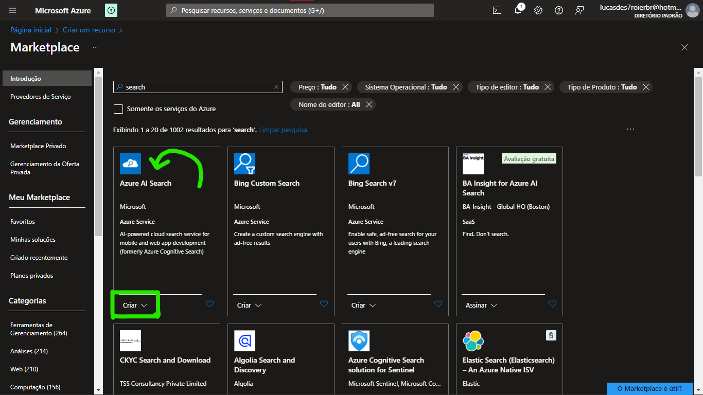
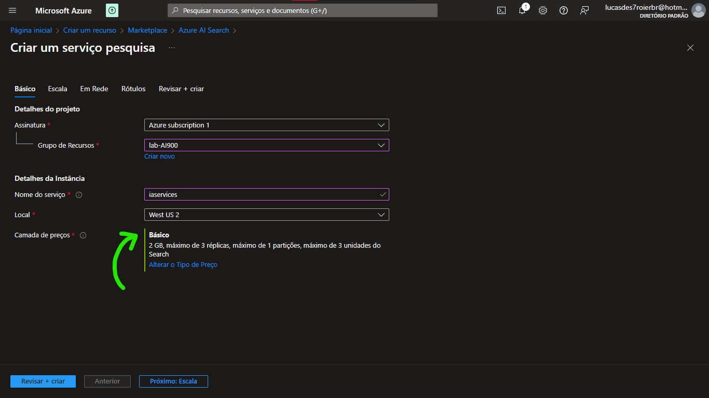

###

2. Crie o recurso **`Azure AI Service`**

###

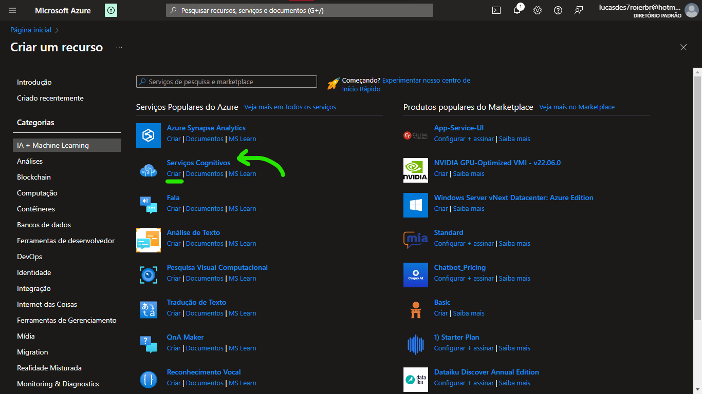
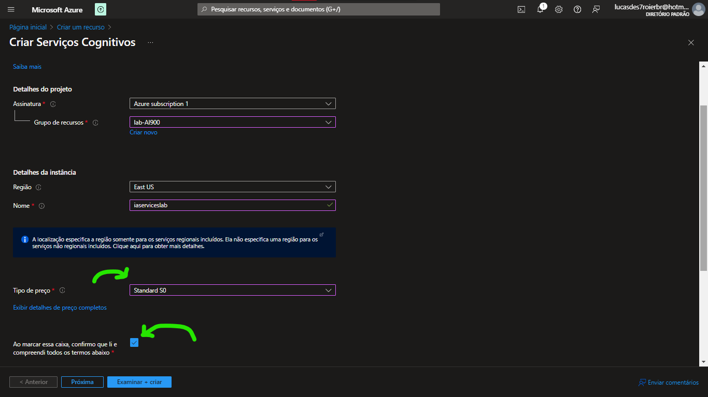

###

3. Crie o recurso **`Storage Accounts`** e faça as configurações conforme o exemplo abaixo:

###

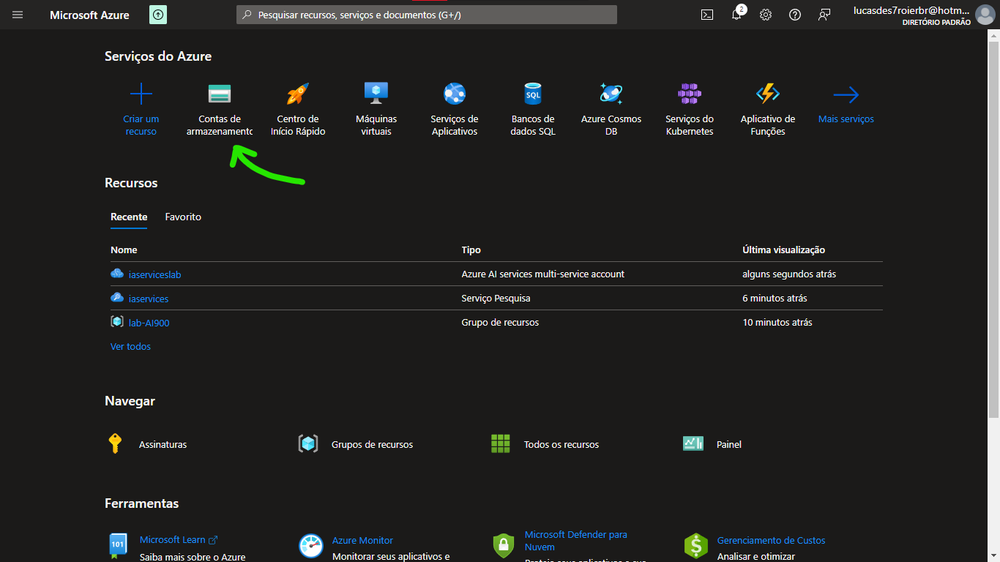
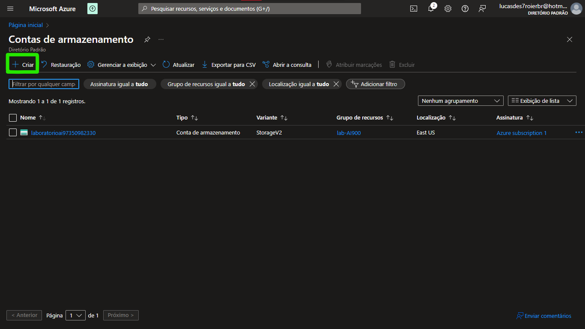
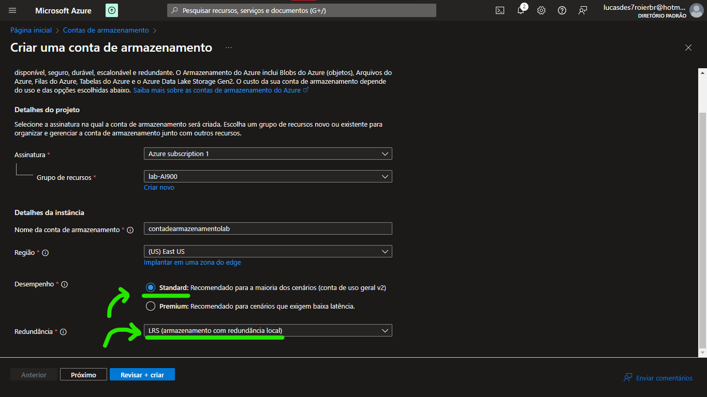
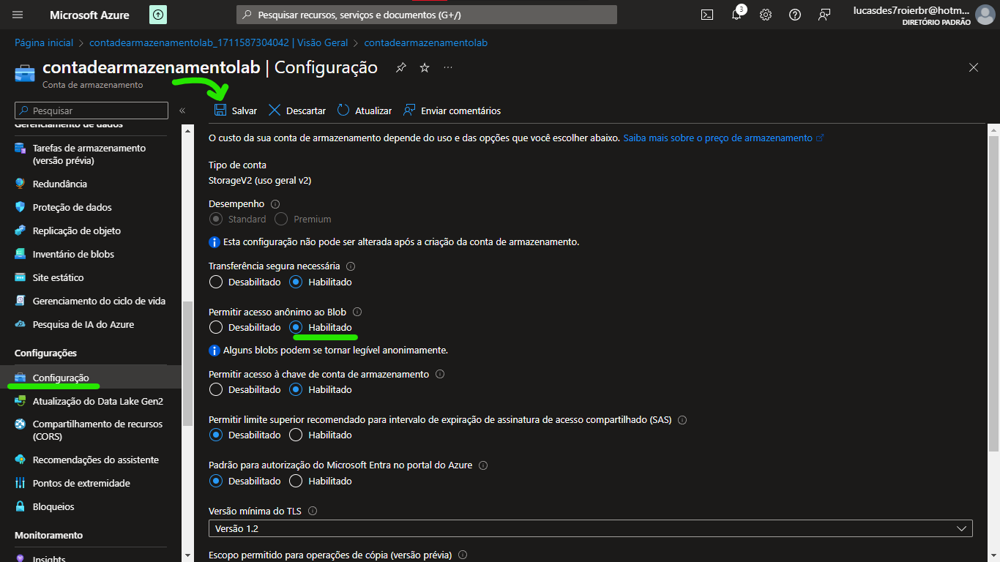
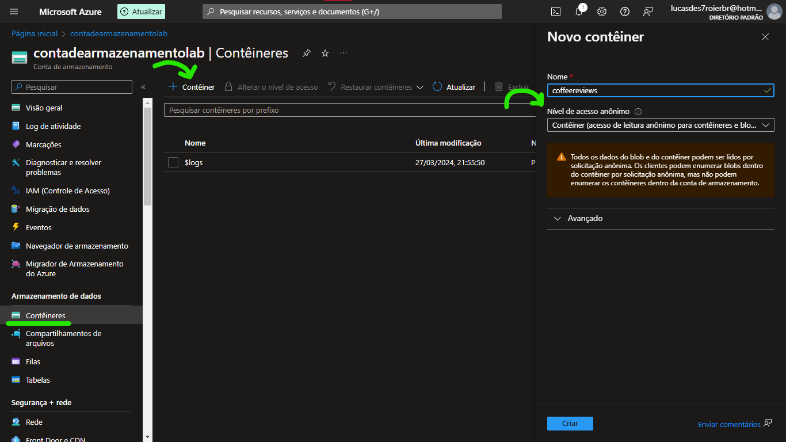
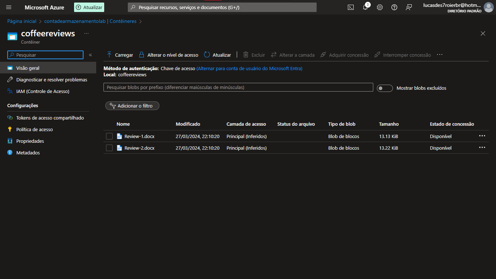

###

4. Volte para o recurso AI Search e siga os seguites passos:

###

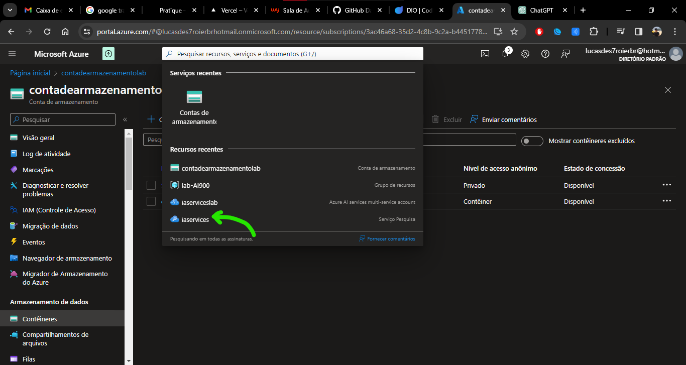
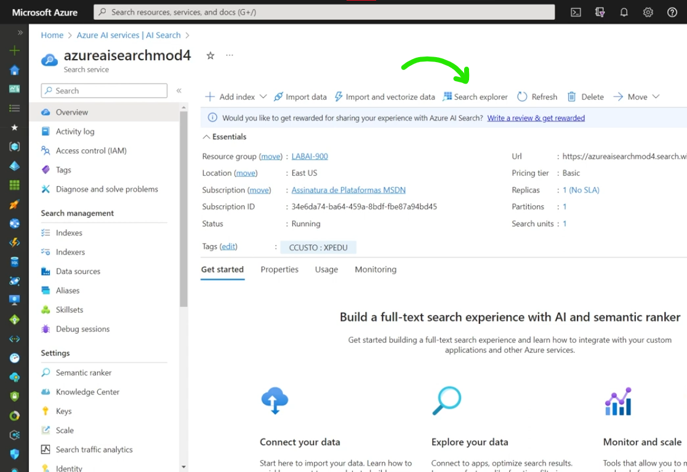

###

> **Agora é só aproveitar essa incrível ferramenta** 🚀🚀

###

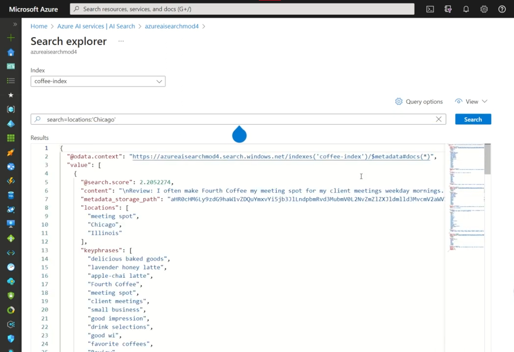

###

# Insights e Possibilidades

### Análise de Pesquisa:

- Entender as consultas de pesquisa mais comuns realizadas pelos usuários.
- Identificar termos de pesquisa populares e tendências ao longo do tempo.
- Analisar padrões de busca para otimizar a relevância dos resultados de pesquisa.

### Análise de Conteúdo:

- Identificar palavras-chave e tópicos mais relevantes em seu conteúdo.
- Descobrir insights sobre o conteúdo mais popular ou mais acessado.
- Analisar a distribuição de tipos de conteúdo (por exemplo, artigos, vídeos, imagens) em seu índice de pesquisa.

### Personalização de Conteúdo:

- Usar insights sobre o comportamento do usuário para personalizar os resultados da pesquisa.
- Recomendar conteúdo relevante com base no histórico de pesquisa e preferências do usuário.
- Implementar estratégias de personalização para melhorar a experiência do usuário e a taxa de engajamento.

### Análise de Sentimento:

- Analisar o sentimento dos usuários em relação ao conteúdo (por exemplo, análise de sentimentos em comentários de produtos).
- Identificar tendências de sentimento positivo ou negativo em relação a determinados tópicos ou produtos.
- Usar análise de sentimento para adaptar estratégias de marketing e desenvolvimento de produtos.

### Análise de Intenção:

- Compreender as intenções por trás das consultas de pesquisa dos usuários.
- Identificar padrões de comportamento e intenções para fornecer resultados de pesquisa mais relevantes.
- Personalizar a experiência do usuário com base nas intenções identificadas.

### Aprimoramento da Experiência do Usuário:

- Melhorar a relevância e precisão dos resultados da pesquisa para aumentar a satisfação do usuário.
- Implementar recursos de pesquisa avançados, como sugestões de pesquisa, correção automática e realce de sintaxe para melhorar a experiência do usuário.
- Otimizar a velocidade de pesquisa e resposta para garantir uma experiência fluida e responsiva.